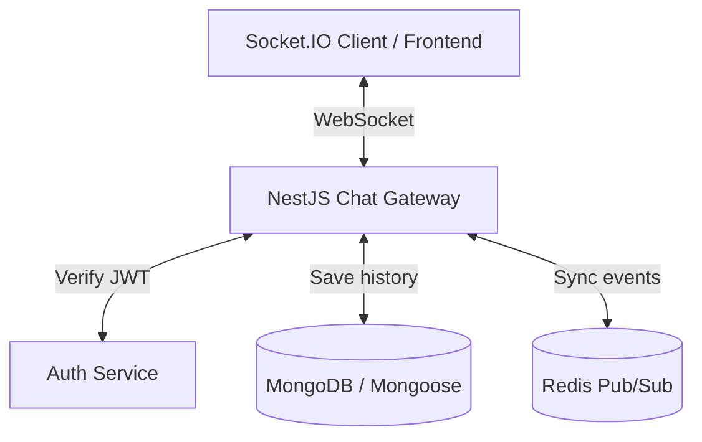

# Plan hoc Realtime Chat voi NestJS

## 1. Muc tieu

- Xay dung duoc mot chat realtime co ban bang NestJS + Socket.IO + MongoDB.
- Xac thuc nguoi dung bang JWT khi mo ket noi WebSocket.
- Luu tin nhan vao database va phat realtime cho cac thanh vien trong phong.
- Co the mo rong len nhieu instance bang Redis Adapter khi can scale.

## 2. Kien truc tong quan



## 3. Kien thuc can nam theo thu tu

### Buoc 1: WebSocket va NestJS Gateway

- Hieu khac biet giua HTTP request/response va ket noi WebSocket 2 chieu.
- Nam cach NestJS to chuc realtime qua `@nestjs/websockets`.
- Chon Socket.IO de co san reconnect, rooms, namespaces, ack event.

```bash
npm i @nestjs/websockets @nestjs/platform-socket.io socket.io socket.io-client
```

### Buoc 2: Thiet ke du lieu chat

Toi thieu nen co 2 collection:

#### `conversations`

- `name`: ten phong, dung cho group chat
- `isGroup`: phan biet chat 1-1 hay chat nhom
- `users`: danh sach `ObjectId` cua thanh vien
- `lastMessage`: tham chieu tin nhan gan nhat de render danh sach chat

#### `messages`

- `conversation`: phong chat chua tin nhan
- `sender`: nguoi gui
- `content`: noi dung text hoac link media
- `readBy` hoac read state rieng neu can toi uu

#### Viec can lam o buoc nay

- Tao `conversation.schema.ts` va `message.schema.ts`
- Tao `conversations.module.ts` va `messages.module.ts`
- Tao service xu ly du lieu chat, chua can full CRUD scaffold
- Tao REST API toi thieu de frontend co du lieu nen truoc khi noi realtime

#### API toi thieu nen co

- `POST /conversations`
- `GET /conversations`
- `GET /conversations/:id`
- `GET /conversations/:id/messages`

#### Chua can lam ngay

- Chua can `PUT /messages/:id`
- Chua can `DELETE /messages/:id` theo kieu hard delete
- Chua can edit message, recall for everyone, delete for everyone o giai doan dau

#### Ket qua mong doi

- MongoDB luu duoc conversation va message dung quan he
- Co API de frontend render danh sach chat va lich su chat
- Co service san de Gateway goi khi nhan event `send_message`

### Buoc 3: Xac thuc JWT trong WebSocket

- Client gui token khi khoi tao socket, vi du `io(url, { auth: { token } })`
- O server, lay token tu `client.handshake.auth.token`
- Verify token bang `AuthService` hoac `JwtService`
- Neu hop le, gan user vao `client.data.user`
- Neu khong hop le, ngat ket noi

### Buoc 4: Rooms va luong tin nhan

- Moi user join vao room rieng bang chinh `userId` de nhan thong bao ca nhan
- Khi mo mot cuoc tro chuyen, client gui event `join_room`
- Gateway cho socket join room `conversationId`
- Khi gui tin nhan:
    - client emit `send_message`
    - gateway kiem tra quyen truy cap phong
    - luu message vao MongoDB
    - broadcast qua room bang `this.server.to(conversationId).emit(...)`

### Buoc 5: Online, typing, read status

- Online/offline: theo doi socket dang active theo `userId`
- Typing indicator: phat event ngan han trong room
- Read status: cap nhat receipt hoac bang trang thai rieng neu can toi uu

### Buoc 6: Redis Adapter khi scale

- Khi app chay nhieu instance, Socket.IO can Redis de sync event giua cac server
- Dung `@socket.io/redis-adapter`
- Muc tieu la user o server A van nhan duoc message tu user o server B

## 4. Lo trinh thuc hanh

### Tuan 1: Ket noi realtime co ban

- Tao `chat.gateway.ts`
- Bat event connect/disconnect
- Verify JWT luc connect
- Lam mot file client test don gian de gui/nhan event

Ket qua mong doi:

- Ket noi socket thanh cong
- Biet duoc user nao dang online
- Co the join room ca nhan

### Tuan 2: Du lieu va API nen

- Hoan thien schema `Conversation` va `Message`
- Viet REST API de:
    - tao cuoc tro chuyen
    - lay danh sach cuoc tro chuyen
    - lay lich su tin nhan
- Kiem tra quyen truy cap conversation truoc khi tra du lieu

Ket qua mong doi:

- Co the tao va doc du lieu chat tu MongoDB
- Co API du dung de frontend hien thi danh sach va lich su chat

### Tuan 3: Realtime message flow

- Hoan thien event `join_room` va `send_message`
- Luu message roi broadcast cho dung room
- Them typing indicator
- Them online/offline state

Ket qua mong doi:

- Gui tin nhan realtime duoc end-to-end
- Nguoi trong cung phong nhan message ngay lap tuc

### Tuan 4: Toi uu va mo rong

- Tich hop Redis Adapter cho Socket.IO
- Kiem tra chay nhieu instance
- Bo sung test co ban cho gateway / luong realtime neu co the

Ket qua mong doi:

- Realtime chay on khi scale
- Kien truc du sach de mo rong them notification, read receipt, file upload

#########################################################################

createMessage(senderId, conversationId, dto)
Đây là method quan trọng nhất.
Việc nó nên làm:
check conversation tồn tại
check sender là member
validate replyTo nếu có
tạo message
update conversation.lastMessageId
restore conversation nếu đang bị hide
set readReceipts[senderId] = newMessageId
Đây là method socket send_message sẽ gọi trực tiếp.

getMessagesByConversation(conversationId, userId, query)
Phục vụ:
load lịch sử ban đầu khi mở room
load thêm tin cũ khi scroll lên
Nên có:
check member
cursor
limit
sort theo createdAt desc
populate senderId
có thể populate replyTo tối thiểu

getMessageById(messageId)
Bạn đã có rồi, giữ lại.
Dùng cho:
reply
fetch detail
validation nội bộ

checkMessageExistInConversation(messageId, conversationId)
Bạn cũng đã có rồi.
Socket và service đều cần để validate replyTo hoặc markAsRead.
Rất nên có để ráp socket

deleteMessage(messageId, userId)
Giai đoạn đầu chỉ cần soft delete
Socket event kiểu delete_message hoặc recall_message sẽ gọi nó
Rule:
chỉ sender được xóa, hoặc sau này thêm admin

getLatestMessageOfConversation(conversationId)
Hữu ích khi:
user join room
cần lấy message mới nhất để sync
đối chiếu unread/read state

markSenderRead(conversationId, senderId, messageId)
Có thể không cần tách riêng nếu createMessage tự gọi conversationService.markAsRead
Nhưng nếu tách helper thì code rõ hơn

Nếu làm socket-friendly hơn nữa

serializeMessageForClient(message)
Chuẩn hóa payload emit socket
Để REST và socket trả cùng shape
Ví dụ:
\_id
conversationId
senderId
type
content
replyTo
createdAt
getUnreadCount(conversationId, userId)
Chưa bắt buộc ngay
Nhưng sau này rất tiện cho chat list và badge unread
Flow socket mình khuyên bám theo

join_room

verify JWT ở gateway
check user là member
socket join conversationId
send_message

gateway nhận payload
gọi messagesService.createMessage(...)
emit message_created vào room
mark_read

gateway gọi conversationsService.markAsRead(...)
emit conversation_read hoặc message_read
load_history

thực ra thường gọi REST tốt hơn socket
socket chỉ nên lo event realtime
Bộ method tối thiểu mình khuyên bạn làm ngay

createMessage
getMessagesByConversation
getMessageById
checkMessageExistInConversation
deleteMessage
Nếu muốn đi rất thực dụng, thứ tự code là:

createMessage
getMessagesByConversation
deleteMessage
rồi mới viết gateway/socket
Nếu bạn muốn, mình có thể phác luôn interface cho MessagesService và tên endpoint tương ứng để bạn code một mạch.
