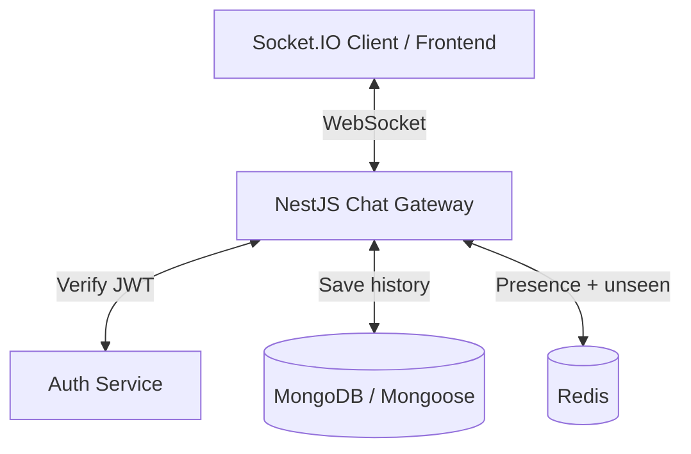

# Plan học Realtime Chat với NestJS

## 1. Mục tiêu

- Xây dựng được chat realtime cơ bản bằng NestJS + Socket.IO + MongoDB.
- Xác thực người dùng bằng JWT khi mở kết nối WebSocket.
- Lưu tin nhắn vào database và phát realtime cho đúng thành viên.
- Quản lý online/offline và `unseen conversation` bằng Redis.
- Làm nền cho `mark_read`, sidebar có tin nhắn mới, và sau đó mới tới read receipt chi tiết.

## 2. Kiến trúc tổng quan



## 3. Trạng thái hiện tại

### Backend nền đã có

- `ConversationsService.createConversation`
- `ConversationsService.findAllByUser`
- `ConversationsService.findOne`
- `ConversationsService.markAsRead`
- `ConversationsService.getAllConversationIdsByUser`
- `ConversationsService.getConversationOrThrow`
- `ConversationsService.ensureMemberInConversation`
- `MessagesService.createMessage`
- `MessagesService.getMessagesByConversation`
- `MessagesService.getMessageById`
- `MessagesService.checkMessageExistInConversation`
- `MessagesService.softDeleteMessage`

### Realtime hiện đã làm xong

- Đã có `chat.gateway.ts`
- Đã verify JWT khi socket connect
- Đã gán `client.data.user`
- Đã cho socket join room riêng theo `userId`
- Đã có event join conversation: `chat:join-conversation`
- Đã có event gửi tin nhắn: `chat:create-message`
- Đã lưu DB xong rồi mới emit `chat:new-message`
- Đã có heartbeat: `user:heartbeat`
- Đã có presence online/offline bằng Redis TTL
- Đã emit `user:online` và `user:offline` theo conversation room
- Đã có file FE test để connect, join conversation, load history, send message, và nhận realtime

### Redis hiện đã làm xong

- Đã có `setPresence(userId)` với TTL
- Đã có `getPresence(userId)`
- Đã có `getUserOnlineInListIds(members)`
- Đã subscribe Redis key expiration để phát hiện offline
- Đã dùng Redis cho online/offline

### Những gì chưa xong

- Chưa có `unseen conversation` cho sidebar
- Chưa có event riêng báo sidebar có tin mới
- Chưa có chống emit lặp cho cùng 1 conversation chưa xem
- Chưa nối `mark_read` với Redis để clear trạng thái unseen
- Chưa có typing event
- Chưa có read receipt chi tiết ở mức từng message / từng user

## 4. Đánh giá hiện tại

Hiện tại backend đã đi qua được phần khó nhất của giai đoạn đầu:

- Socket auth đã chạy
- Join room đã chạy
- Gửi tin nhắn realtime đã chạy end-to-end
- Presence online/offline đã có Redis nền

Nghĩa là project đã qua giai đoạn "lắp socket cơ bản". Phần tiếp theo không nên nhảy ngay vào UI `đã xem`, mà nên chốt trước state nghiệp vụ cho `unseen` ở backend. Nếu không chốt phần này trước thì sidebar, `mark_read`, và read receipt sẽ bị chồng logic lên nhau.

## 5. Chốt hướng xử lý tiếp theo

### Nguyên tắc

- `Đang gửi` và `đã gửi` là state hiển thị ở FE.
- `Có tin mới chưa xem` và `đã xem` là state nghiệp vụ, nên chốt ở BE trước.
- FE chỉ nên render theo state / event mà BE phát ra, không nên tự đoán unread/read.

### Ưu tiên tiếp theo

1. Làm `unseen conversation` ở Redis
2. Emit event riêng cho sidebar khi có tin mới
3. Cho FE load và render trạng thái unseen
4. Nối `mark_read` với Redis để clear unseen
5. Sau đó mới làm read receipt chi tiết

## 6. Kế hoạch Redis cho unseen conversation

### Mục tiêu

Chưa cần unread count chính xác. Giai đoạn này chỉ cần biết:

- user nào đang có conversation chưa xem
- conversation nào cần tô đậm / gắn badge ở sidebar
- tránh emit lặp lại cùng một tín hiệu "có tin mới" khi conversation đã dirty rồi

### Redis key

Mỗi user có một `Set`:

```text
unseen:conversations:{userId}
```

Ví dụ:

```text
unseen:conversations:123
```

Set này chứa các `conversationId` mà user `123` đang có tin mới chưa xem.

### Luồng khi tạo message

Giả sử user A gửi message vào conversation `convG`.

#### Bước 1: Tạo message trong DB

- Gateway nhận `chat:create-message`
- Gọi `messagesService.createMessage(...)`
- Chỉ đi tiếp khi DB tạo thành công

#### Bước 2: Emit message realtime cho room conversation

- Emit `chat:new-message` vào room conversation như hiện tại
- Người đang mở conversation sẽ thấy tin nhắn ngay

#### Bước 3: Lấy danh sách thành viên của conversation

- Lấy toàn bộ member ids
- Bỏ sender ra khỏi danh sách

#### Bước 4: Lọc user online

- Dùng Redis hiện có để biết member nào đang online
- Chỉ cần xử lý `unseen` realtime cho user online ở giai đoạn này

#### Bước 5: Đánh dấu unseen bằng `SADD`

Với từng user online khác sender:

```text
SADD unseen:conversations:{userId} {conversationId}
```

Ý nghĩa giá trị trả về:

- `1`: conversation vừa chuyển từ `clean` sang `dirty`
- `0`: conversation đã dirty từ trước rồi

#### Bước 6: Chỉ emit khi `SADD == 1`

Nếu `SADD == 1` thì emit event riêng cho room user đó:

```ts
this.server.to(getRoomNameUser(userId)).emit('conversation:dirty', {
    conversationId,
});
```

Nếu `SADD == 0` thì bỏ qua.

Đây là chỗ chống gửi lặp.

### Tại sao `SADD` hợp với bài toán này

Vì `SADD` tự trả lời luôn câu hỏi:

- user này với conversation này đã có cờ unseen chưa?

Không cần:

- `GET`
- `EXISTS`
- rồi mới `SET`

Chỉ cần `SADD` là đủ để biết có cần emit sidebar nữa hay không.

### Tối ưu khi có nhiều user online

Không nên `await redis.sadd(...)` tuần tự từng vòng.

Nên dùng `pipeline`:

- gom nhiều lệnh `SADD`
- chạy một lần
- dựa vào kết quả để lọc user nào cần emit `conversation:dirty`

## 7. Kế hoạch mark read gắn với unseen

### Mục tiêu

Khi user mở conversation hoặc FE xác nhận đã đọc:

- cập nhật read state trong DB
- clear cờ unseen trong Redis
- báo về FE để sidebar bỏ badge / bỏ highlight

### Luồng đề xuất

#### Bước 1: Tạo event `chat:mark-read`

Payload tối thiểu:

- `conversationId`
- `messageId`

#### Bước 2: Xử lý DB

- Gateway check membership
- Gọi `conversationsService.markAsRead(conversationId, userId, messageId)`

#### Bước 3: Clear unseen trong Redis

```text
SREM unseen:conversations:{userId} {conversationId}
```

#### Bước 4: Trả ack hoặc emit event

Có thể chọn một trong hai:

- trả ack cho sender socket hiện tại
- hoặc emit `conversation:read` vào room riêng của user để nhiều tab cùng clear

Nếu user có thể mở nhiều tab thì nên emit vào room riêng của user.

## 8. Kế hoạch cho sidebar

### Mục tiêu giai đoạn này

Sidebar chỉ cần biết:

- conversation nào đang unseen
- conversation nào vừa mới dirty

Chưa cần unread count chính xác.

### Dữ liệu FE cần có

- danh sách conversation từ REST như hiện tại
- thêm danh sách `unseen conversation ids`
- lắng nghe event `conversation:dirty`
- lắng nghe event `conversation:read` nếu dùng multi-tab

### Hướng load ban đầu

Khi connect socket hoặc load conversations:

- FE nên gọi thêm một API hoặc socket event để lấy toàn bộ unseen conversations hiện tại của user
- sau đó realtime chỉ cần cập nhật incrementally bằng event `conversation:dirty` và `conversation:read`

## 9. Thứ tự làm tiếp theo

### Bước 1: Hoàn thiện Redis service cho unseen

Thêm các helper:

- `addUnseenConversation(userId, conversationId)`
- `removeUnseenConversation(userId, conversationId)`
- `getUnseenConversationIds(userId)`
- `isConversationUnseen(userId, conversationId)` nếu cần
- helper batch bằng `pipeline` để đánh dấu unseen cho nhiều user online

Kết quả mong đợi:

- RedisService đủ API để gateway dùng thẳng

### Bước 2: Nối unseen vào `chat:create-message`

- Sau khi create message thành công và emit `chat:new-message`
- Lấy member ids, bỏ sender
- Lọc user online
- Dùng `SADD` hoặc `pipeline`
- Emit `conversation:dirty` cho đúng user khi `SADD == 1`

Kết quả mong đợi:

- Sidebar có tín hiệu realtime "conversation này vừa có tin mới chưa xem"
- Không bị spam emit lặp

### Bước 3: Thêm event lấy unseen ban đầu

Có thể là:

- REST API riêng
- hoặc socket event như `chat:get-unseen-conversations`

Kết quả mong đợi:

- FE vừa connect xong là sync được trạng thái sidebar hiện tại

### Bước 4: Làm `chat:mark-read`

- Gọi `markAsRead(...)`
- `SREM unseen:conversations:{userId} {conversationId}`
- ack hoặc emit `conversation:read`

Kết quả mong đợi:

- User mở conversation thì sidebar sạch lại đúng cách

### Bước 5: FE test lại toàn bộ flow

Test ít nhất các case:

- User B đang online nhưng chưa mở conversation, A gửi tin nhắn => B nhận `conversation:dirty`
- A gửi tiếp nhiều tin trong cùng conversation chưa xem => B không bị spam dirty lặp
- B mở conversation và mark read => cờ unseen bị clear
- Sau khi B đã read, A gửi tin mới lần nữa => B lại nhận dirty mới

### Bước 6: Sau đó mới làm read receipt chi tiết

Chỉ làm bước này sau khi `unseen` + `mark_read` + sidebar đã ổn.

Lúc đó mới quyết định:

- event `message:read`
- payload ai đã xem
- hiển thị `đã xem` ở message cuối hay ở từng message

## 10. Todo rất cụ thể để code tiếp

### Todo ngay bây giờ

- Bổ sung helper Redis cho `unseen conversation`
- Chèn logic `unseen` vào sau `chat:create-message`
- Tạo event hoặc API lấy `unseen conversations` ban đầu
- Tạo event `chat:mark-read`
- Clear unseen bằng `SREM` khi read
- Emit event sync sidebar nếu cần multi-tab
- FE test lại flow dirty/read cơ bản

### Chưa cần làm ngay

- Redis adapter cho multi-instance Socket.IO
- Unread count chính xác cho mỗi conversation
- Typing indicator
- Read receipt chi tiết từng message
- Notification đầy đủ
- File upload realtime
- Recall message for everyone

## 11. Chốt ngắn gọn

Hiện tại project đã xong phần:

- socket auth
- join conversation
- send message realtime
- presence online/offline

Việc nên làm tiếp theo không phải là UI `đã xem`, mà là chốt state `unseen conversation` ở Redis trước. Khi phần này ổn thì sidebar, `mark_read`, và read receipt mới có nền chung để đi tiếp mà không bị vá chồng logic.
