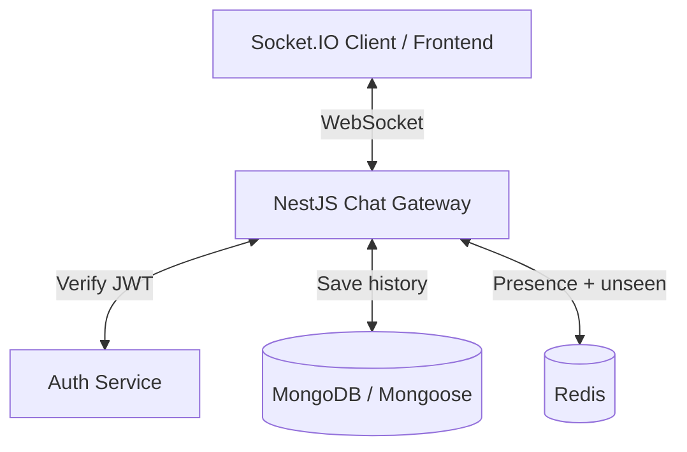

# Plan học Realtime Chat với NestJS

## 1. Mục tiêu

- Xây dựng được chat realtime cơ bản bằng NestJS + Socket.IO + MongoDB.
- Xác thực người dùng bằng JWT khi mở kết nối WebSocket.
- Lưu tin nhắn vào database và phát realtime cho đúng thành viên.
- Quản lý online/offline và `unseen conversation` bằng Redis.
- Làm nền cho `mark_read`, sidebar có tin nhắn mới, và sau đó mới tới read receipt chi tiết.

## 2. Kiến trúc tổng quan

## 3. Trạng thái hiện tại

### Backend nền đã có

- `ConversationsService.createConversation`
- `ConversationsService.findAllByUser`
- `ConversationsService.findOne`
- `ConversationsService.markAsRead`
- `ConversationsService.getAllConversationIdsByUser`
- `ConversationsService.getConversationOrThrow`
- `ConversationsService.ensureMemberInConversation`
- `MessagesService.createMessage`
- `MessagesService.getMessagesByConversation`
- `MessagesService.getMessageById`
- `MessagesService.checkMessageExistInConversation`
- `MessagesService.softDeleteMessage`

### Realtime hiện đã làm xong

- Đã có `chat.gateway.ts`
- Đã verify JWT khi socket connect
- Đã gán `client.data.user`
- Đã cho socket join room riêng theo `userId`
- Đã có event join conversation: `chat:join-conversation`
- Đã có event gửi tin nhắn: `chat:create-message`
- Đã lưu DB xong rồi mới emit `chat:new-message`
- Đã có heartbeat: `user:heartbeat`
- Đã có presence online/offline bằng Redis TTL
- Đã emit `user:online` và `user:offline` theo conversation room
- Đã có file FE test để connect, join conversation, load history, send message, và nhận realtime

### Redis hiện đã làm xong

- Đã có `setPresence(userId)` với TTL
- Đã có `getPresence(userId)`
- Đã có `getUserOnlineInListIds(members)`
- Đã subscribe Redis key expiration để phát hiện offline
- Đã dùng Redis cho online/offline
- `unseen conversation` cho sidebar
- event riêng báo sidebar có tin mới
- chống emit lặp cho cùng 1 conversation chưa xem
- `mark_read` với Redis để clear trạng thái unseen
- có typing event
- có đã xem đã gửi đang gửi

### Đề xuất phát triển tiếp theo (Next Steps)

Dựa trên cấu trúc app và các tính năng đã hoàn thiện, dưới đây là các tính năng nên được ưu tiên phát triển để hệ thống hoàn chỉnh hơn:

1. **Quản lý File & Media (Attachments)**
   - Hỗ trợ gửi hình ảnh, video, tài liệu qua tin nhắn.
   - Tích hợp Cloud Storage (như AWS S3, Cloudinary hoặc MinIO) thay vì lưu local để dễ scale.

2. **Push Notifications (Thông báo nền)**
   - Tích hợp Firebase Cloud Messaging (FCM) hoặc Web Push.
   - Đảm bảo user nhận được thông báo tin nhắn mới ngay cả khi offline hoặc đóng trình duyệt.

3. **Message Actions Nâng cao**
   - Thu hồi tin nhắn (Recall/Delete message for everyone).
   - Chỉnh sửa nội dung tin nhắn đã gửi (Edit message).
   - Reply tin nhắn (Threading/Quoted messages).
   - Thả cảm xúc (Reactions) cho tin nhắn.

4. **Tối ưu Hiệu suất & Scale (Performance)**
   - **Pagination**: Áp dụng cursor-based pagination cho API load tin nhắn để hỗ trợ Infinite Scroll, thay vì load toàn bộ.
   - **Redis Adapter**: Cài đặt `@socket.io/redis-adapter` để hỗ trợ chạy multi-instance (khi deploy qua Docker Swarm / K8s).
   - **Caching Message**: Cân nhắc cache 50 tin nhắn mới nhất của mỗi conversation vào Redis để load cực nhanh mà không cần chọc DB.

5. **Quản lý Nhóm Nâng cao (Group Management)**
   - Phân quyền cơ bản: Admin, Member.
   - Thêm/Xóa/Kick thành viên khỏi nhóm, rời nhóm.
   - Đổi tên và thay đổi avatar nhóm.

6. **Hiển thị Trạng thái Online tinh gọn**
   - Cập nhật hiển thị "Hoạt động X phút trước" (Last seen) dựa trên lần cuối user ping heartbeat.
