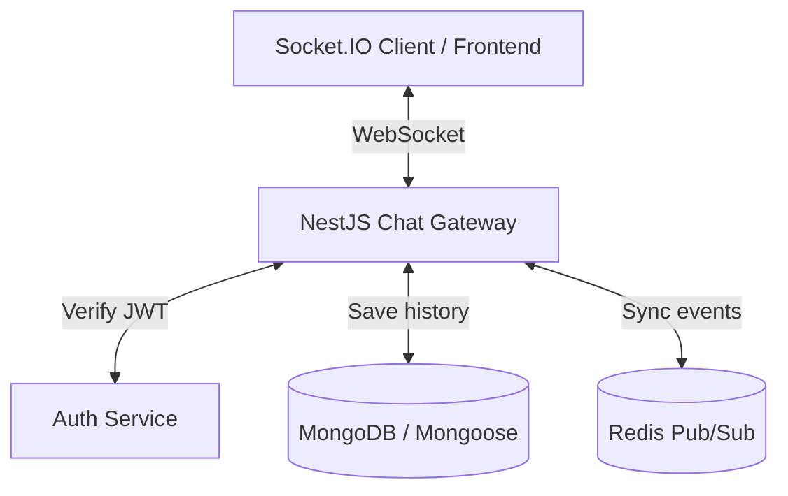

# Plan học Realtime Chat với NestJS

## 1) Mục tiêu
- Xây dựng được một chat realtime cơ bản bằng NestJS + Socket.IO + MongoDB.
- Xác thực người dùng bằng JWT khi mở kết nối WebSocket.
- Lưu tin nhắn vào database và phát realtime cho các thành viên trong phòng.
- Mở rộng được lên nhiều instance bằng Redis Adapter khi cần scale.

## 2) Kiến trúc tổng quan



## 3) Kiến thức cần nắm theo thứ tự

### Bước 1: WebSocket và NestJS Gateway
- Hiểu khác biệt giữa HTTP request/response và kết nối WebSocket 2 chiều.
- Nắm cách NestJS tổ chức realtime qua `@nestjs/websockets`.
- Chọn Socket.IO để có sẵn reconnect, rooms, namespaces, ack event.

```bash
npm i @nestjs/websockets @nestjs/platform-socket.io socket.io socket.io-client
```

### Bước 2: Thiết kế dữ liệu chat
Tối thiểu nên có 2 collection:

#### `conversations`
- `name`: tên phòng, dùng cho group chat.
- `isGroup`: phân biệt chat 1-1 hay chat nhóm.
- `users`: danh sách `ObjectId` của thành viên.
- `lastMessage`: tham chiếu tin nhắn gần nhất để render danh sách chat.

#### `messages`
- `conversation`: phòng chat chứa tin nhắn.
- `sender`: người gửi.
- `content`: nội dung text hoặc link media.
- `readBy`: danh sách user đã đọc.

#### Việc cần làm ở bước này
- Tạo `conversation.schema.ts` và `message.schema.ts`.
- Tạo `chat.module.ts` hoặc `conversations.module.ts` nếu muốn tách module rõ ràng.
- Tạo service để xử lý dữ liệu chat, chưa cần làm full CRUD máy móc.
- Tạo các REST API tối thiểu để frontend có dữ liệu nền trước khi nối realtime.

#### API tối thiểu nên có
- `POST /conversations`: tạo cuộc trò chuyện mới.
- `GET /conversations`: lấy danh sách cuộc trò chuyện của user hiện tại.
- `GET /conversations/:id`: lấy thông tin một cuộc trò chuyện.
- `GET /conversations/:id/messages`: lấy lịch sử tin nhắn theo phòng, có phân trang nếu được.

#### Chưa cần làm ngay
- Chưa cần `PUT /messages/:id` hoặc `DELETE /messages/:id`.
- Chưa cần gen full resource cho `Message`.
- Chưa cần làm edit message, recall message, delete for everyone ở giai đoạn đầu.

#### Kết quả mong đợi của bước này
- MongoDB lưu được conversation và message đúng quan hệ.
- Có API để frontend render danh sách chat và lịch sử chat.
- Có chỗ service sẵn để Gateway gọi khi nhận event `send_message`.

### Bước 3: Xác thực JWT trong WebSocket
- Client gửi token khi khởi tạo socket, ví dụ `io(url, { auth: { token } })`.
- Ở server, lấy token từ `client.handshake.auth.token`.
- Verify token bằng `AuthService` hoặc `JwtService`.
- Nếu hợp lệ, gắn user vào `client.data.user`.
- Nếu không hợp lệ, ngắt kết nối.

### Bước 4: Rooms và luồng tin nhắn
- Mỗi user join vào room riêng bằng chính `userId` để nhận thông báo cá nhân.
- Khi mở một cuộc trò chuyện, client gửi event `join_room`.
- Gateway cho socket join room `conversationId`.
- Khi gửi tin nhắn:
  - client emit `send_message`
  - gateway kiểm tra quyền truy cập phòng
  - lưu message vào MongoDB
  - broadcast qua room bằng `this.server.to(conversationId).emit(...)`

### Bước 5: Online, typing, read status
- Online/offline: theo dõi socket đang active theo `userId`.
- Typing indicator: phát event ngắn hạn trong room.
- Read status: cập nhật `readBy` hoặc một bảng trạng thái riêng nếu cần tối ưu.

### Bước 6: Redis Adapter khi scale
- Khi app chạy nhiều instance, Socket.IO cần Redis để sync event giữa các server.
- Dùng `@socket.io/redis-adapter`.
- Mục tiêu là user ở server A vẫn nhận được message từ user ở server B.

## 4) Lộ trình thực hành

### Tuần 1: Kết nối realtime cơ bản
- Trạng thái hiện tại: chưa làm phần WebSocket/Gateway.
- Tạo `chat.module.ts` và `chat.gateway.ts`.
- Bắt event connect/disconnect.
- Verify JWT ở lúc connect.
- Làm một file client test đơn giản để gửi/nhận event.

**Kết quả mong đợi**
- Kết nối socket thành công.
- Biết được user nào đang online.
- Có thể join room cá nhân.

### Tuần 2: Dữ liệu và API nền
- Trạng thái hiện tại: đang làm, đã xong phần schema/module/service/controller cơ bản cho `conversations`, nhưng `messages` vẫn chưa hoàn thiện nghiệp vụ.
- Tạo schema `Conversation` và `Message`.
- Viết REST API để:
  - tạo cuộc trò chuyện
  - lấy danh sách cuộc trò chuyện
  - lấy lịch sử tin nhắn
- Kiểm tra quyền truy cập conversation trước khi trả dữ liệu.

**Kết quả mong đợi**
- Có thể tạo và đọc dữ liệu chat từ MongoDB.
- Có API đủ dùng để frontend hiển thị danh sách và lịch sử chat.

### Tuần 3: Realtime message flow
- Trạng thái hiện tại: chưa bắt đầu.
- Hoàn thiện event `join_room` và `send_message`.
- Lưu message rồi broadcast cho đúng room.
- Thêm typing indicator.
- Thêm online/offline state.

**Kết quả mong đợi**
- Gửi tin nhắn realtime được end-to-end.
- Người trong cùng phòng nhận message ngay lập tức.

### Tuần 4: Tối ưu và mở rộng
- Trạng thái hiện tại: chưa bắt đầu.
- Tích hợp Redis Adapter cho Socket.IO.
- Kiểm tra chạy nhiều instance.
- Bổ sung test cơ bản cho gateway / luồng realtime nếu có thể.

**Kết quả mong đợi**
- Realtime chạy ổn khi scale.
- Kiến trúc đủ sạch để mở rộng thêm notification, read receipt, file upload.

## 5) Tình trạng hiện tại theo code

### Đã xong
- [x] Tạo `ConversationSchema` với `users`, `isGroup`, `adminGroupId`, `lastMessageId`, `deletedHistory`.
- [x] Tạo `MessageSchema` với `conversationId`, `senderId`, `content`, `readBy`.
- [x] Tách `ConversationsModule` và `MessagesModule`.
- [x] Có API `POST /conversations`.
- [x] Có API `GET /conversations`.
- [x] Có API `GET /conversations/:id`.
- [x] Đã kiểm tra quyền thành viên khi lấy conversation.
- [x] Đã xử lý khá kỹ nghiệp vụ tạo conversation 1-1 và group trong `conversations.service.ts`.

### Đã làm một phần
- [ ] API lấy lịch sử chat theo conversation.
  Hiện tại đã có `MessagesModule` và `MessageSchema`, nhưng `messages.service.ts` vẫn đang là scaffold.
- [ ] Lưu message vào MongoDB và cập nhật `lastMessageId`.
  Trong `ConversationsService` đã có hàm `updateLastMessageAndRestoreConversation`, nhưng chưa thấy luồng tạo message thật để gọi hàm này.
- [ ] Test cho conversations/messages.
  Đã có file spec được tạo, nhưng cần kiểm tra và hoàn thiện nội dung test.

### Chưa làm
- [ ] Kết nối Socket.IO thành công.
- [ ] Verify JWT khi connect WebSocket.
- [ ] Join room cá nhân.
- [ ] Join room conversation.
- [ ] Gửi và nhận message realtime.
- [ ] Online/offline status.
- [ ] Typing indicator.
- [ ] Redis Adapter cho Socket.IO.

## 6) Việc cần làm tiếp

### Ưu tiên 1: Hoàn thiện API nền cho message
- Tạo nghiệp vụ `createMessage` trong `messages.service.ts` để lưu MongoDB.
- Sau khi tạo message, gọi cập nhật `conversation.lastMessageId`.
- Thêm API lấy lịch sử theo kiểu `GET /conversations/:id/messages` hoặc service tương đương.
- Kiểm tra quyền thành viên trước khi đọc/gửi message.

### Ưu tiên 2: Dọn scaffold thừa ở `messages`
- Xóa hoặc thay thế các endpoint scaffold kiểu `findAll`, `findOne(+id)`, `update(+id)`, `remove(+id)` nếu chưa dùng.
- Đổi API sang đúng bài toán chat thay vì CRUD resource mặc định.

### Ưu tiên 3: Bắt đầu phần realtime
- Tạo `chat.gateway.ts` hoặc `conversations.gateway.ts`.
- Xác thực JWT từ `client.handshake.auth.token`.
- Cho user join personal room theo `userId`.
- Thêm event `join_room` và `send_message`.
- Nối luồng realtime với `MessagesService` và `ConversationsService`.

### Ưu tiên 4: Bổ sung test
- Hoàn thiện unit test cho `conversations.service.ts`.
- Viết test cho `messages.service.ts` sau khi có nghiệp vụ thật.
- Khi có gateway, thêm test cho auth socket và message flow cơ bản.

## 7) Gợi ý cách đi tiếp
- Không nên sang Redis hoặc typing sớm ở thời điểm này.
- Thứ tự hợp lý nhất hiện tại là: hoàn thiện `messages` -> nối `conversation.lastMessageId` -> làm gateway realtime -> thêm online/typing -> cuối cùng mới Redis.
