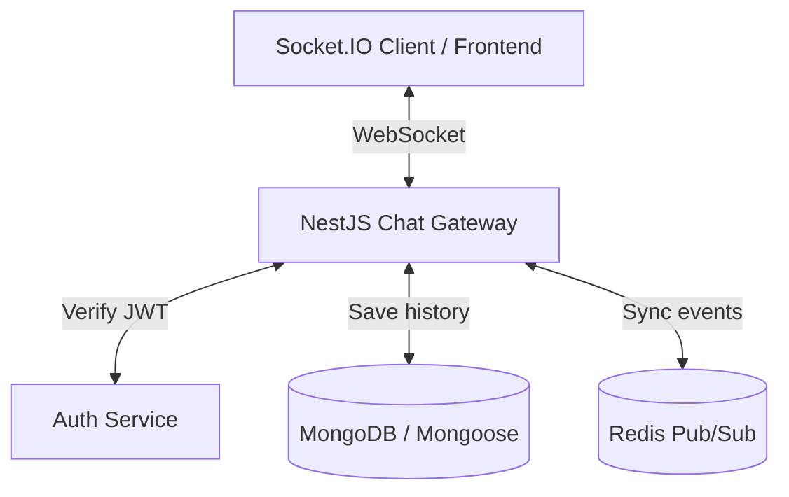

# Plan học Realtime Chat với NestJS

## 1. Mục tiêu

- Xây dựng được một chat realtime cơ bản bằng NestJS + Socket.IO + MongoDB.
- Xác thực người dùng bằng JWT khi mở kết nối WebSocket.
- Lưu tin nhắn vào database và phát realtime cho các thành viên trong phòng.
- Có thể mở rộng lên nhiều instance bằng Redis Adapter khi cần scale.

## 2. Kiến trúc tổng quan



## 3. Kiến thức cần nắm theo thứ tự

### Bước 1: WebSocket và NestJS Gateway

- Hiểu khác biệt giữa HTTP request/response và kết nối WebSocket 2 chiều.
- Nắm cách NestJS tổ chức realtime qua `@nestjs/websockets`.
- Chọn Socket.IO để có sẵn reconnect, rooms, namespaces, ack event.

```bash
npm i @nestjs/websockets @nestjs/platform-socket.io socket.io socket.io-client
```

### Bước 2: Thiết kế dữ liệu chat

Tối thiểu nên có 2 collection:

#### `conversations`

- `name`: tên phòng, dùng cho group chat
- `isGroup`: phân biệt chat 1-1 hay chat nhóm
- `users`: danh sách `ObjectId` của thành viên
- `lastMessage`: tham chiếu tin nhắn gần nhất để render danh sách chat

#### `messages`

- `conversation`: phòng chat chứa tin nhắn
- `sender`: người gửi
- `content`: nội dung text hoặc link media
- `readBy` hoặc read state riêng nếu cần tối ưu

#### Việc cần làm ở bước này

- Tạo `conversation.schema.ts` và `message.schema.ts`
- Tạo `conversations.module.ts` và `messages.module.ts`
- Tạo service xử lý dữ liệu chat, chưa cần full CRUD scaffold
- Tạo REST API tối thiểu để frontend có dữ liệu nền trước khi nối realtime

#### API tối thiểu nên có

- `POST /conversations`
- `GET /conversations`
- `GET /conversations/:id`
- `GET /conversations/:id/messages`

#### Chưa cần làm ngay

- Chưa cần `PUT /messages/:id`
- Chưa cần `DELETE /messages/:id` theo kiểu hard delete
- Chưa cần edit message, recall for everyone, delete for everyone ở giai đoạn đầu

#### Kết quả mong đợi

- MongoDB lưu được conversation và message đúng quan hệ
- Có API để frontend render danh sách chat và lịch sử chat
- Có service sẵn để Gateway gọi khi nhận event `send_message`

### Bước 3: Xác thực JWT trong WebSocket

- Client gửi token khi khởi tạo socket, ví dụ `io(url, { auth: { token } })`
- Ở server, lấy token từ `client.handshake.auth.token`
- Verify token bằng `AuthService` hoặc `JwtService`
- Nếu hợp lệ, gán user vào `client.data.user`
- Nếu không hợp lệ, ngắt kết nối

### Bước 4: Rooms và luồng tin nhắn

- Mỗi user join vào room riêng bằng chính `userId` để nhận thông báo cá nhân
- Khi mở một cuộc trò chuyện, client gửi event `join_room`
- Gateway cho socket join room `conversationId`
- Khi gửi tin nhắn:
  - client emit `send_message`
  - gateway kiểm tra quyền truy cập phòng
  - lưu message vào MongoDB
  - broadcast qua room bằng `this.server.to(conversationId).emit(...)`

### Bước 5: Online, typing, read status

- Online/offline: theo dõi socket đang active theo `userId`
- Typing indicator: phát event ngắn hạn trong room
- Read status: cập nhật receipt hoặc bảng trạng thái riêng nếu cần tối ưu

### Bước 6: Redis Adapter khi scale

- Khi app chạy nhiều instance, Socket.IO cần Redis để sync event giữa các server
- Dùng `@socket.io/redis-adapter`
- Mục tiêu là user ở server A vẫn nhận được message từ user ở server B

## 4. Lộ trình thực hành

### Tuần 1: Kết nối realtime cơ bản

- Tạo `chat.gateway.ts`
- Bắt event connect/disconnect
- Verify JWT lúc connect
- Làm một file client test đơn giản để gửi/nhận event

Kết quả mong đợi:

- Kết nối socket thành công
- Biết được user nào đang online
- Có thể join room cá nhân

### Tuần 2: Dữ liệu và API nền

- Hoàn thiện schema `Conversation` và `Message`
- Viết REST API để:
  - tạo cuộc trò chuyện
  - lấy danh sách cuộc trò chuyện
  - lấy lịch sử tin nhắn
- Kiểm tra quyền truy cập conversation trước khi trả dữ liệu

Kết quả mong đợi:

- Có thể tạo và đọc dữ liệu chat từ MongoDB
- Có API đủ dùng để frontend hiển thị danh sách và lịch sử chat

### Tuần 3: Realtime message flow

- Hoàn thiện event `join_room` và `send_message`
- Lưu message rồi broadcast cho đúng room
- Thêm typing indicator
- Thêm online/offline state

Kết quả mong đợi:

- Gửi tin nhắn realtime được end-to-end
- Người trong cùng phòng nhận message ngay lập tức

### Tuần 4: Tối ưu và mở rộng

- Tích hợp Redis Adapter cho Socket.IO
- Kiểm tra chạy nhiều instance
- Bổ sung test cơ bản cho gateway / luồng realtime nếu có thể

Kết quả mong đợi:

- Realtime chạy ổn khi scale
- Kiến trúc đủ sạch để mở rộng thêm notification, read receipt, file upload

## 5. Trạng thái hiện tại

### Backend nền đã có

- `ConversationsService.createConversation`
- `ConversationsService.findAllByUser`
- `ConversationsService.findOne`
- `ConversationsService.markAsRead`
- `MessagesService.createMessage`
- `MessagesService.getMessagesByConversation`
- `MessagesService.getMessageById`
- `MessagesService.checkMessageExistInConversation`
- `MessagesService.softDeleteMessage`

### Đánh giá hiện tại

- Đã đủ điều kiện để chuyển sang làm `socket realtime`.
- REST vẫn nên dùng để load danh sách conversation và history ban đầu.
- Socket chỉ nên tập trung vào các event realtime như `join_room`, `send_message`, `mark_read`, `typing`.

### Cần chốt lại trước khi ráp socket

- Đảm bảo payload message trả từ REST và payload emit từ socket cùng một shape.
- Soát lại các chỗ dùng `hiddenHistory.find(...)` để tránh lỗi khi `hiddenHistory` là `undefined`.
- Xác định rõ tên event và format ack/error để FE test dễ biết cách bắt.

## 6. Kế hoạch tiếp theo với realtime

### Mục tiêu giai đoạn này

- Kết nối được socket có JWT.
- User join được room theo `conversationId`.
- Gửi tin nhắn realtime và lưu DB thành công.
- Đọc message và typing có event để FE test ngay được.

### Thứ tự làm thực dụng

#### Bước 1: Dọn backend để socket-friendly

- Chuẩn hóa `serializeMessage` để `createMessage`, `getMessageById`, `getMessagesByConversation` trả cùng shape.
- Kiểm tra lại `replyTo`, `sender`, `conversationId`, `createdAt`.
- Fix các edge case liên quan `hiddenHistory`.
- Nếu cần, bổ sung helper check member conversation để gateway gọi lại dễ đọc hơn.

Kết quả mong đợi:

- Service đủ ổn định để gateway gọi trực tiếp.
- Payload REST và socket không bị lệch nhau.

#### Bước 2: Tạo `chat.gateway.ts`

- Dùng `@WebSocketGateway()`.
- Bắt `handleConnection` và `handleDisconnect`.
- Verify JWT từ `client.handshake.auth.token`.
- Gán user vào `client.data.user`.
- Cho mỗi socket join room riêng theo `userId`.

Kết quả mong đợi:

- Kết nối socket hợp lệ mới được phép vào.
- Có thể quản lý socket theo user.

#### Bước 3: Làm event `join_room`

- Client gửi `conversationId`.
- Gateway check user có phải member của conversation không.
- Nếu hợp lệ thì `client.join(conversationId)`.
- Có thể trả ack thành công kèm thông tin room đã join.

Kết quả mong đợi:

- Socket chỉ join được room mà user có quyền truy cập.

#### Bước 4: Làm event `send_message`

- Gateway nhận `conversationId`, `type`, `content`, `replyTo`.
- Gọi `messagesService.createMessage(...)`.
- Emit `message_created` vào room `conversationId`.
- Nếu muốn để debug ngon hơn, trả ack message vừa tạo cho sender.

Kết quả mong đợi:

- Gửi tin nhắn realtime end-to-end.
- Message lưu DB xong mới phát cho room.

#### Bước 5: Làm event `mark_read`

- Gateway nhận `conversationId` và `messageId`.
- Gọi `conversationsService.markAsRead(...)`.
- Emit `conversation_read` hoặc `message_read` vào room.

Kết quả mong đợi:

- Có read state cơ bản để sau này gắn vào UI.

#### Bước 6: Làm event `typing`

- `typing_start`
- `typing_stop`
- Broadcast vào room, không cần lưu DB.

Kết quả mong đợi:

- FE test thấy được typing indicator cơ bản.

## 7. FE nên làm đến mức nào

### Khuyến nghị

- Chưa cần làm FE thật ngay.
- Nên làm một FE test đơn giản trước, có thể là 1 trang HTML hoặc 1 page React rất mỏng.

### FE test tối thiểu cần có

- Ô nhập `token`
- Ô nhập `conversationId`
- Nút `connect socket`
- Nút `join room`
- Ô nhập message và nút `send`
- Khu vực log event nhận được từ socket

### Tại sao nên đi theo cách này

- Debug socket nhanh hơn debug UI thật.
- Tách được lỗi backend realtime với lỗi state management ở frontend.
- Khi flow ổn rồi mới ghép vào FE thật sẽ ít rối hơn.

## 8. Todo rất cụ thể để code tiếp

### Todo ngay bây giờ

- Fix các chỗ có khả năng lỗi trong `messages.service.ts`.
- Chuẩn hóa serializer message.
- Tạo `chat.gateway.ts`.
- Code `handleConnection`, `join_room`, `send_message`, `mark_read`, `typing`.
- Tạo FE test đơn giản để bạn tự bấm và nhìn log.

### Chưa cần làm ngay

- Redis adapter
- Multi instance
- Notification đầy đủ
- Unread count chính xác cho mỗi conversation
- File upload realtime
- Recall message for everyone
